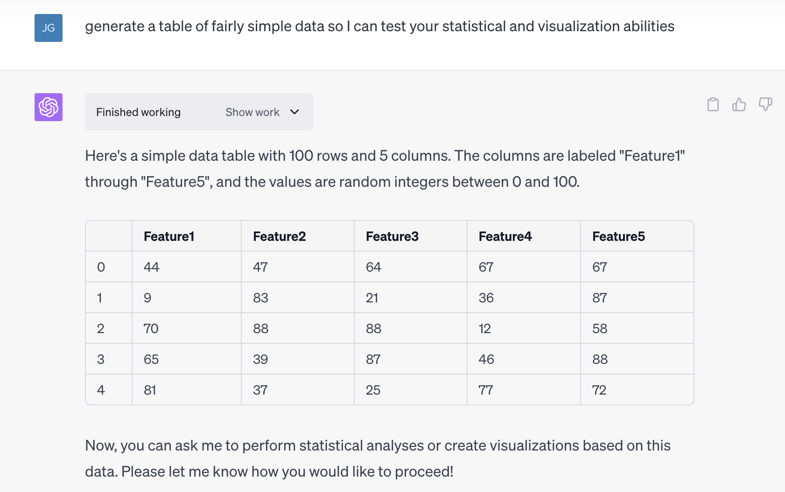
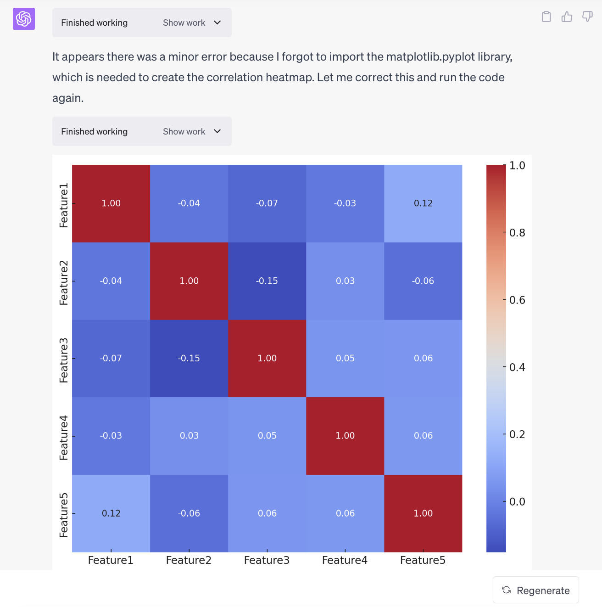
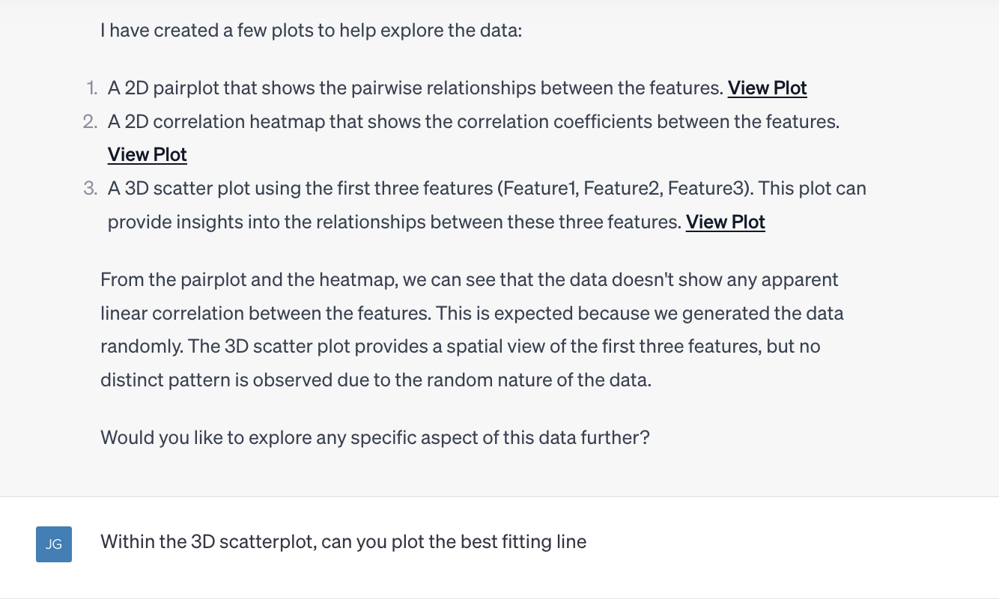
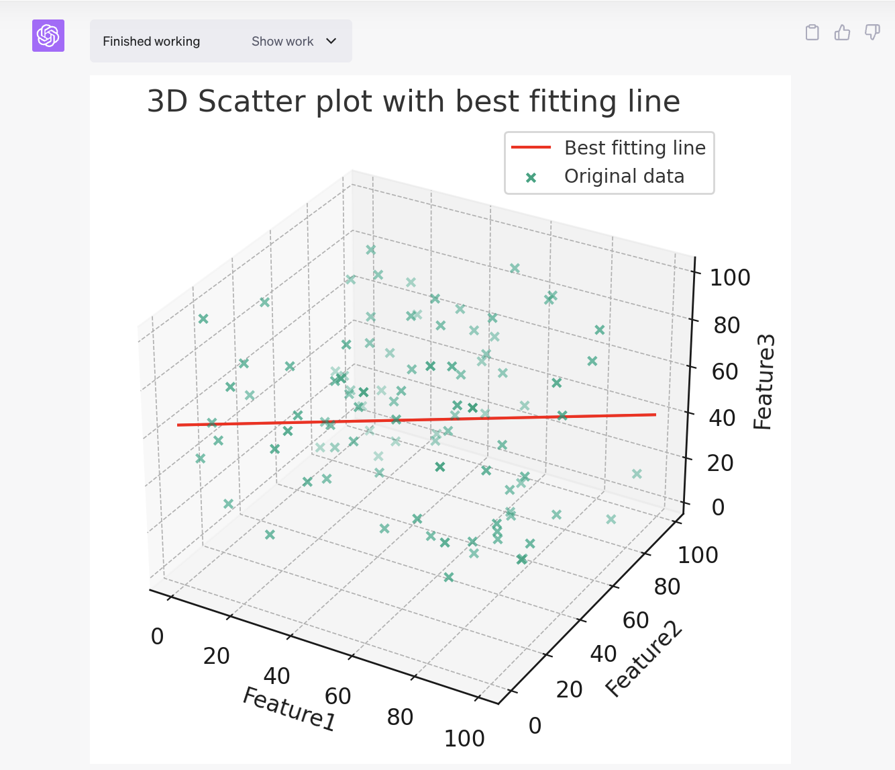
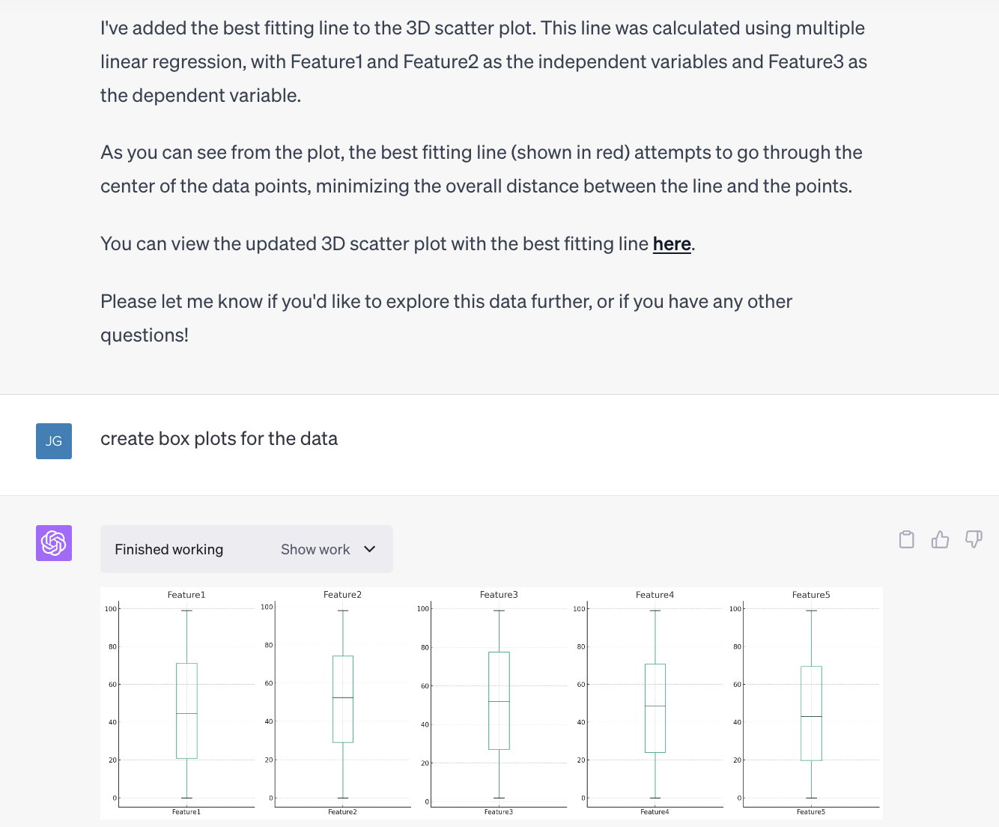
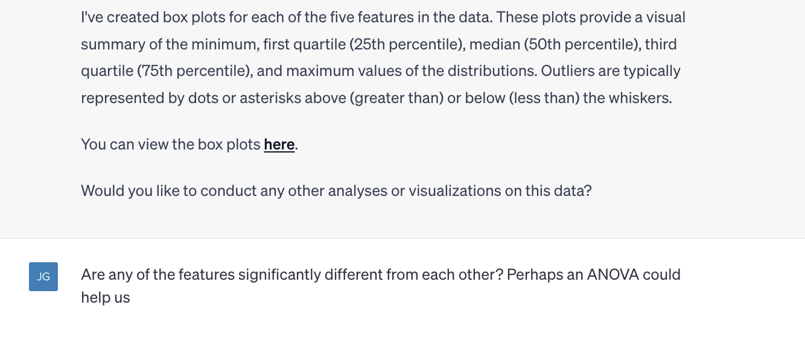
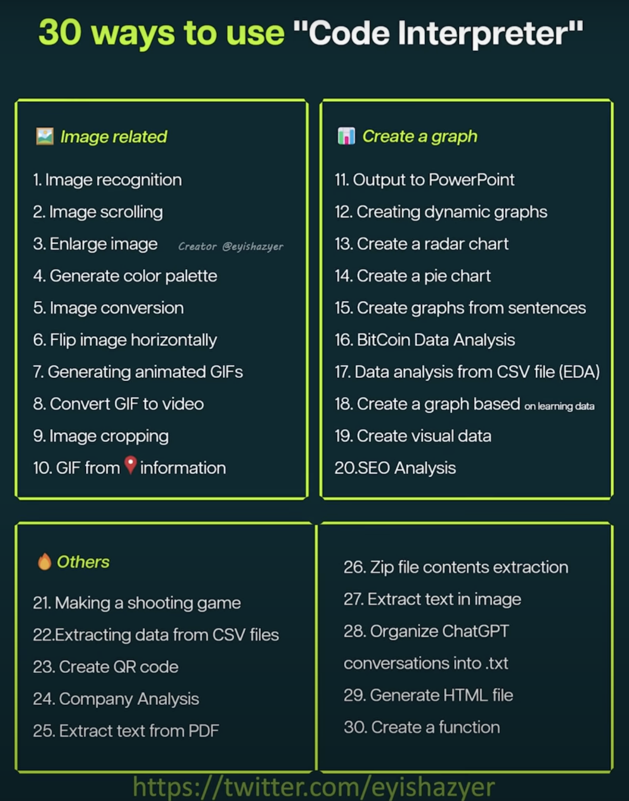

## Third-Party Plugins

ChatGPT [Plugins](https://openai.com/blog/chatgpt-plugins){target=_blank} are in Beta release and available for chatGPT Plus subscribers.

Plugins are a way to extend the functionality of chatGPT. They are tools that chatGPT can use and usually involve interacting with a live website or third-party application. To use the plugins, users need to activate them first. Please watch the gif below to see how to activate a plugin.

??? Tip "Enable Plugins and Code Interpreter"

    <figure markdown>
    { width="600" }
    <figcaption> Enable Plugin and Code Interpreter</figcaption>
    </figure>

Once enabled, plugins are available to use directly in the chatGPT interface. There are already hundreds of plugins available that can do many different tasks. This plugin model is setting up a world where you can do almost anything within chatGPT.

* For example, if you enable the *Expedia* plugin, you can search for flights, hotels, and anything else that Expedia does,    and do it all within the chatGPT interface. 

* Using the *ScholarAI* plugin, you can search for academic papers and have them summarized for you. Currently, it only connects to Springer-Nature articles. But it shows the power and promise of automated literature reviews.

* With another plugin called *Video Insights*, you can drop in links to videos on the web and it can provide you a summary of the video and write out the full transcript.

* With a plugin called *Michelangelo*, you can generate custom images based on your text prompts. It uses DALL-E 2 as the engine. 

* Plugins like *WebPilot* enable you to connect chatGPT to the internet. 

* The *Wolfram* plugin allows you to do complex math, science calculations, and data visualizations

The list goes on and on. Explore the plugins and see what you can do! 

For some plugin recommendations check out these youtubers 

<iframe width="500" height="300" src="https://www.youtube.com/embed/XbkBjdwwyJA" title="I tried ALL ChatGPT PLUGINS and here&#39;s the best!" frameborder="0" allow="accelerometer; autoplay; clipboard-write; encrypted-media; gyroscope; picture-in-picture; web-share" allowfullscreen></iframe>

<iframe width="500" height="300" src="https://www.youtube.com/embed/3GDf9xArVJw" title="ChatGPT Plugins: Are They Really Helping Researchers or Just Hype?" frameborder="0" allow="accelerometer; autoplay; clipboard-write; encrypted-media; gyroscope; picture-in-picture; web-share" allowfullscreen></iframe>

 

## Code Interpreter

[Code Interpreter](https://openai.com/blog/chatgpt-plugins#code-interpreter){target=_blank} is a plugin developed in-house at OpenAI. Through initial experiments, it appears to be a very powerful plugin that can do a variety of tasks. Let's take a look. 

The big advance of [Code Interpreter](https://openai.com/blog/chatgpt-plugins#code-interpreter){target=_blank}, is that it allows you to upload files and then ask the chatbot to analyze them. 

??? Tip "According to chatGPT, here are the files types that can be uploaded and analyzed"

    - `.py`: Python scripts
    - `.txt`: Text files
    - `.csv`: Comma-separated values (CSV) files
    - `.json`: JavaScript Object Notation (JSON) files
    - `.xls`, `.xlsx`: Excel files
    - `.pkl`: Pickle files
    - `.h5`: Hierarchical Data Format (HDF) files
    - `.jpg`, `.png`, etc.: Various image formats
    - `.mp3`, `.wav`, etc.: Various audio formats

    Code Interpreter will also accept zipped files that contain several individual files. This hack allows you get more data into the chatbot without having to use so many precious prompts. 

 When you ask the bot to do something, it will write python code and then ***actually execute the code*** within a sandboxed environment in the chat. Simply amazing!

For data scientists, [Code Interpreter](https://openai.com/blog/chatgpt-plugins#code-interpreter){target=_blank} is going to be a game changer. You can upload tables of data to chatGPT and it can do all kinds of statisical analyis and visualizations with simple natural language prompts. 

??? Tip "A Simple Data Analysis Conversation with Code Interpreter"
  
    {width=600}
    {width=600}
    {width=600}
    {width=600}
    {width=600}
    {width=600}
    {width=600}
    {width=600}
    {width=600}

<figure markdown>
{ width="450" }
<figcaption></figcaption>
</figure>

'30 Ways' content is from this [Youtube Video](https://www.youtube.com/watch?v=FF_HzfqxS2o)

{ width="100" } Should I actually trust chatGPT to analyze data?

You can ask it to create a visual word cloud of the document. 
I asked it to create a histogram of the most common words in the document.

Custom Instructions for Code Interpreter

## BARD Capabilities

Since BARD is connected to the internet, you can give it a link to a research paper and it will read it and answer question based on it. 

When I upload an image, Bard does an impressive job of describing what is in the image. chatGPT cannot do that I think. 

